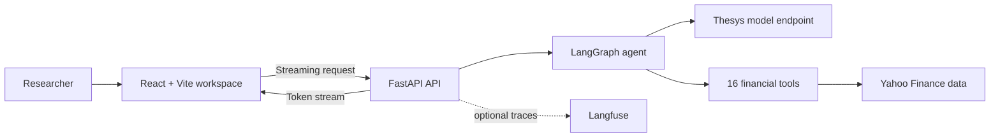

<div align="center">

# Market Insight

### AI-assisted market research, grounded in live financial data

[](https://github.com/KamranUllahAfaq/Market-Insight/actions/workflows/ci.yml)
[](https://www.python.org/)
[](https://react.dev/)
[](LICENSE)

Ask a market question in plain language. Market Insight selects the relevant
research tools, retrieves current company data, and streams a structured answer
into a focused research workspace.

</div>

> [!IMPORTANT]
> Market Insight is an educational research tool. Its output is not personalized
> financial advice, and market data may be incomplete or delayed.

## Why Market Insight?

Financial research often means moving between quote pages, filings, ownership
tables, news feeds, and analyst reports. Market Insight brings those steps into
one conversational workflow while keeping data retrieval separate from the
model's interpretation.

- **Live research tools** — prices, historical data, company profiles, financial
  statements, holders, insider activity, dividends, splits, news, and analyst
  sentiment.
- **Tool-aware AI workflow** — company names can be resolved to tickers before
  ticker-specific research begins.
- **Streaming interface** — analysis appears as it is produced instead of waiting
  for one large response.
- **Persistent conversations** — LangGraph checkpoints maintain context within a
  research thread.
- **Observable execution** — optional Langfuse traces make agent behavior easier
  to inspect in production.
- **Responsive workspace** — a purpose-built React interface for desktop and
  mobile research.

## Architecture



## Research capabilities

| Area | Available tools |
| --- | --- |
| Market activity | Current price, dated price history, company news |
| Fundamentals | Company profile and ratios, balance sheet, income statement, cash flow |
| Corporate actions | Dividend history, stock splits |
| Ownership | Institutional, major, and mutual-fund holders |
| Market opinion | Analyst recommendations and recommendation summaries |
| Insider data | Reported insider transactions |
| Discovery | Company-name to ticker resolution |

## Tech stack

| Layer | Technology |
| --- | --- |
| Frontend | React 19, TypeScript, Vite, Thesys Generative UI |
| API | FastAPI, Pydantic, Uvicorn |
| Agent | LangChain, LangGraph, OpenAI-compatible Thesys endpoint |
| Data | `yfinance` and Yahoo Finance search |
| Observability | Langfuse (optional) |
| Deployment | Vercel frontend, Render backend |

## Quick start

### Prerequisites

- Python 3.11 or newer
- Node.js 20 or newer
- An API key accepted by the configured Thesys endpoint

### 1. Clone and configure

```bash
git clone https://github.com/KamranUllahAfaq/Market-Insight.git
cd Market-Insight
cp .env.example .env
cp frontend/.env.example frontend/.env.local
```

On PowerShell, use `Copy-Item` instead of `cp` if aliases are disabled.

Set `OPENAI_API_KEY` in `.env`. Langfuse variables are optional. To allow a
deployed frontend, add its origin to the comma-separated `CORS_ORIGINS` value.

### 2. Install dependencies

Using [`uv`](https://docs.astral.sh/uv/) is recommended because the repository
includes a lockfile:

```bash
uv sync
cd frontend
npm install
cd ..
```

Alternatively, install the backend with:

```bash
python -m venv .venv
pip install -r requirements.txt
```

### 3. Run the application

In one terminal:

```bash
uv run uvicorn main:app --reload --port 8000
```

In another:

```bash
cd frontend
npm run dev
```

Open `http://localhost:5173`. API documentation is available at
`http://localhost:8000/docs`, and the health probe is
`http://localhost:8000/health`.

## Environment variables

### Backend

| Variable | Required | Purpose |
| --- | :---: | --- |
| `OPENAI_API_KEY` | Yes | Authenticates with the configured model endpoint |
| `CORS_ORIGINS` | No | Comma-separated allowed frontend origins |
| `LANGFUSE_PUBLIC_KEY` | No | Enables Langfuse tracing |
| `LANGFUSE_SECRET_KEY` | No | Enables Langfuse tracing |
| `LANGFUSE_HOST` | No | Langfuse server URL |
| `PORT` | No | API port; defaults to `8000` |

### Frontend

| Variable | Required | Purpose |
| --- | :---: | --- |
| `VITE_API_URL` | No | Chat endpoint; defaults to local FastAPI |

## Project structure

```text
.
├── MarketInsight/
│   ├── components/agent.py     # Model, tools, and checkpoint wiring
│   └── utils/
│       ├── logger.py           # Application logging
│       └── tools.py            # Financial research tools
├── config/config.py            # Validated API request models
├── frontend/
│   ├── public/                 # Static brand assets
│   └── src/                    # React workspace
├── .github/workflows/ci.yml    # Frontend and backend checks
├── main.py                     # FastAPI application
├── render.yaml                 # Render service definition
└── pyproject.toml              # Python project and dependencies
```

## API

`POST /api/chat` accepts the message format used by the Thesys chat interface
and returns a token stream with `text/event-stream`.

```json
{
  "prompt": {
    "content": "Compare the fundamentals of AAPL and MSFT.",
    "id": "message-1",
    "role": "user"
  },
  "threadId": "research-thread-1",
  "responseId": "response-1"
}
```

## Quality checks

```bash
python -m compileall main.py config MarketInsight
cd frontend
npm run lint
npm run build
```

The same checks run on pushes and pull requests through GitHub Actions.

## Deployment

- **Backend:** `render.yaml` contains the Render web-service definition. Add the
  required environment variables in the Render dashboard.
- **Frontend:** deploy the `frontend` directory to Vercel and set
  `VITE_API_URL` to the deployed backend `/api/chat` endpoint.
- **CORS:** add the exact Vercel production origin to `CORS_ORIGINS` on Render.

## Contributing

Contributions are welcome. Please read [CONTRIBUTING.md](CONTRIBUTING.md) before
opening a pull request. For vulnerabilities, follow [SECURITY.md](SECURITY.md)
instead of opening a public issue.

## License

This project is distributed under the [GNU General Public License v3.0](LICENSE).

---

<div align="center">
Built as a transparent, tool-driven approach to everyday market research.
</div>
